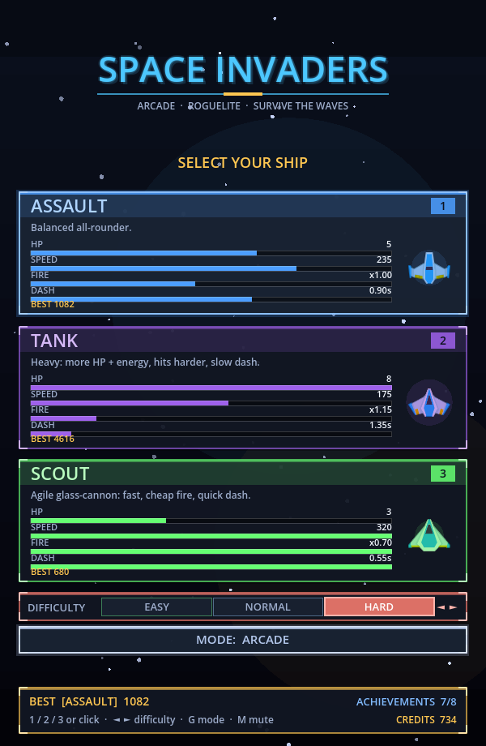

<div align="center">

# 🚀 SPACE INVADERS — Roguelite Arcade Shooter + Physics Lab

A top-down arena shooter built in **Godot 4.6**, playable right in your browser —
with an optional **NGSS-aligned Physics Lab mode** where gravity *is* the gameplay.

### ▶ **[Play now → educatian.github.io/spaceinvaders](https://educatian.github.io/spaceinvaders/)**

<sub>(First load fetches the WebAssembly build, so give it a few seconds.)</sub>



</div>

---

## ✨ Features

- **3 ship classes** — Assault / Tank / Scout, each with distinct stats and a unique hull
- **5 weapons** with per-weapon upgrade levels — Single, Triple, Spiral, Laser, Homing
- **Roguelite upgrade drafts** — pick 1 of 3 cards after each wave to build your run
- **3 difficulties** + persistent high scores, achievements, and meta credits
- **Waves, bosses** (multiple attack patterns), **elites, and biomes**
- **Powerups, combo multiplier, dash, screen-clearing bomb**
- Game feel: hit flash, damage numbers, screen shake, camera punch, gamepad + rumble
- Synthesized sound effects and music — **no audio files**

## 🎮 Controls

| Input | Action | | Input | Action |
|---|---|---|---|---|
| WASD / Arrows | Move | | Shift / Right-click | Dash |
| Mouse | Aim | | E / Middle-click | Bomb (when charged) |
| Left-click / Space | Fire | | Esc / P | Pause |
| Q / Tab | Switch weapon | | O · M | Options · Mute |

Gamepad supported (left stick move, right stick aim, triggers/buttons for fire/dash/bomb).

## 🪐 Physics Lab — an educational mode

Toggle **MODE: PHYSICS LAB** on the ship-select screen (key **G**) and the same game becomes
a hands-on, **NGSS-aligned** physical-science sandbox. Planets ("gravity wells") bend your
shots by a real inverse-square law — to hit anything you have to reason about **vectors,
mass, and distance**, not memorize facts. Every shot is logged as learning telemetry for
formative assessment / learning-analytics research.

| In-game mechanic | NGSS | Status |
|---|---|---|
| Shots curve near planets by `Σ G·m / r²` | **MS-PS2-4** (gravity ∝ mass) | ✅ live |
| Predicted-trajectory overlay (key **T**) | SEP · Developing & using models | ✅ live |
| Shot/hit telemetry → `telemetry.jsonl` (+ `analyze_telemetry.py`) | SEP · Analyzing data | ✅ live |
| Gravity-field visualization (1/r² vector grid) | **MS-PS2-5** (forces at a distance) | 🔶 planned |
| Orbit-insertion challenge, ideal `v = √(GM/r)` | **MS-ESS1-2** (orbital motion) | 🔶 planned |
| Mass-comparison challenge | **MS-PS2-4** | 🔶 planned |
| Firing recoil (action–reaction) | **MS-PS2-1** (Newton's 3rd law) | 🔶 planned |

**Full design spec:** [`docs/EDUCATIONAL_DESIGN.md`](docs/EDUCATIONAL_DESIGN.md) ·
**Standards map:** [`docs/NGSS_ALIGNMENT.md`](docs/NGSS_ALIGNMENT.md)

Target band: middle school (MS-PS2 / MS-ESS1), with extensions toward HS-PS2 / HS-PS3 / HS-ESS1.

## 🛠 Tech

Single-file game logic in GDScript (`scripts/Game.gd`) with procedural + sprite rendering,
particles (`Fx.gd`), and synthesized audio (`Sfx.gd`). Ship/enemy art from the CC0
[Kenney Space Shooter Redux](https://opengameart.org/content/space-shooter-redux) pack.

The `docs/` folder is the GitHub Pages deployment — a no-threads web build that runs
without the COOP/COEP headers GitHub Pages can't set.

### Build the web version yourself

```bash
godot --headless --export-release "Web" docs/index.html
```

## 📄 License

Game code: MIT. Sprite art: CC0 (Kenney). Built with [Godot Engine](https://godotengine.org) 4.6.
